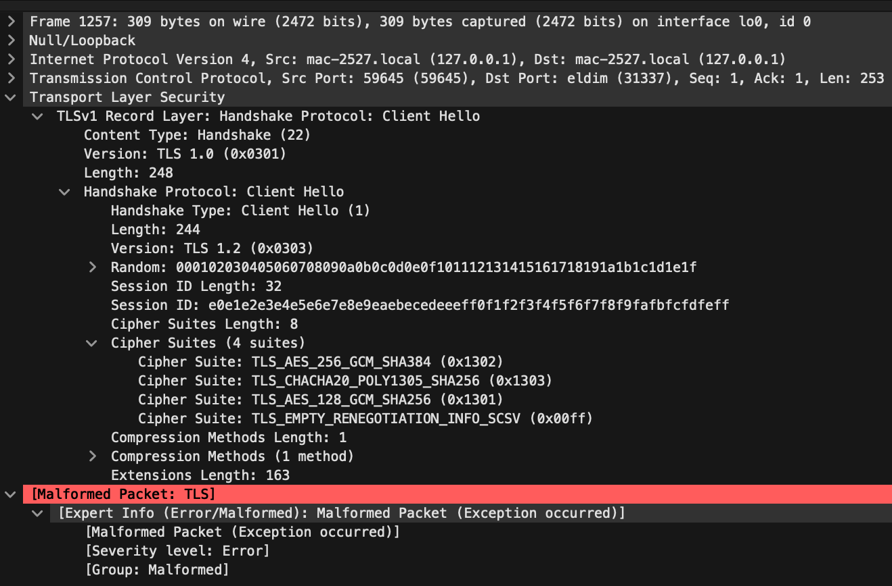

# TLSFuzzer

## Goal

## Roadmap

# Wireshark  

  

## mac
`/Applications/Wireshark.app/Contents/MacOS/Wireshark`  

# SSL Server
## OpenSSL
`openssl req -x509 -newkey rsa:2048 -keyout key.pem -out cert.pem -days 365 -nodes`  
`openssl s_server -key key.pem -cert cert.pem -accept 31337 -www -debug`  
```
Using auto DH parameters
Using default temp ECDH parameters
ACCEPT
read from 0x7fd62ef07c40 [0x7fd630812803] (5 bytes => 5 (0x5))
0000 - 16 03 01 00 f8                                    .....
read from 0x7fd62ef07c40 [0x7fd630812808] (248 bytes => 248 (0xF8))
0000 - 01 00 00 f4 03 03 00 01-02 03 04 05 06 07 08 09   ................
0010 - 0a 0b 0c 0d 0e 0f 10 11-12 13 14 15 16 17 18 19   ................
0020 - 1a 1b 1c 1d 1e 1f 20 e0-e1 e2 e3 e4 e5 e6 e7 e8   ...... .........
0030 - e9 ea eb ec ed ee ef f0-f1 f2 f3 f4 f5 f6 f7 f8   ................
0040 - f9 fa fb fc fd fe ff 00-08 13 02 13 03 13 01 00   ................
0050 - ff 01 00 00 a3 00 00 00-18 00 16 00 00 13 65 78   ..............ex
0060 - 61 6d 70 6c 65 2e 75 6c-66 68 65 69 6d 2e 6e 65   ample.ulfheim.ne
0070 - 74 00 0b 00 04 03 00 01-02 00 0a 00 16 00 14 00   t...............
0080 - 1d 00 17 00 1e 00 19 00-18 01 00 01 01 01 02 01   ................
0090 - 03 01 04 00 23 00 00 00-16 00 00 00 17 00 00 00   ....#...........
00a0 - 0d 00 1e 00 1c 04 03 05-03 06 03 08 07 08 08 08   ................
00b0 - 09 08 0a 08 0b 08 04 08-05 08 06 04 01 05 01 06   ................
00c0 - 01 00 2b 00 03 02 03 04-00 2d 00 02 01 01 00 33   ..+......-.....3
00d0 - 00 26 00 24 00 1d 00 20-35 80 72 d6 36 58 80 d1   .&.$... 5.r.6X..
00e0 - ae ea 32 9a df 91 21 38-38 51 ed 21 a2 8e 3b 75   ..2...!88Q.!..;u
00f0 - e9 65 d0 d2 cd 16 62 54-                          .e....bT
write to 0x7fd62ef07c40 [0x7fd630820200] (7 bytes => 7 (0x7))
0000 - 15 03 03 00 02 02 28                              ......(
4549750444:error:140270C1:SSL routines:ACCEPT_SR_CLNT_HELLO_C:no shared cipher:/System/Volumes/Data/SWE/macOS/BuildRoots/37599d3d49/Library/Caches/com.apple.xbs/Sources/libressl/libressl-56.60.4/libressl-2.8/ssl/ssl_srvr.c:1115:
ACCEPT
```  
## ncat
`ncat -vvvv --listen --ssl`  
```
Ncat: Version 7.91 ( https://nmap.org/ncat )
Ncat: Generating a temporary 2048-bit RSA key. Use --ssl-key and --ssl-cert to use a permanent one.
Ncat: SHA-1 fingerprint: 10B6 FA23 0BEF B596 26D2 66FD 7E87 FD9F 10AF 3A2D
NCAT DEBUG: Initialized fdlist with 103 maxfds
Ncat: Listening on :::31337
NCAT DEBUG: Added fd 3 to list, nfds 1, maxfd 3
Ncat: Listening on 0.0.0.0:31337
NCAT DEBUG: Added fd 4 to list, nfds 2, maxfd 4
NCAT DEBUG: Added fd 0 to list, nfds 3, maxfd 4
NCAT DEBUG: Initialized fdlist with 100 maxfds
NCAT DEBUG: selecting, fdmax 4
NCAT DEBUG: select returned 1 fds ready
NCAT DEBUG: fd 4 is ready
Ncat: Connection from 127.0.0.1.
NCAT DEBUG: Swapping fd[0] (3) with fd[2] (0)
NCAT DEBUG: Removed fd 3 from list, nfds 2, maxfd 4
NCAT DEBUG: Swapping fd[1] (4) with fd[1] (4)
NCAT DEBUG: Removed fd 4 from list, nfds 1, maxfd 0
Ncat: Connection from 127.0.0.1:59106.
NCAT DEBUG: Added fd 5 to list, nfds 2, maxfd 5
NCAT DEBUG: selecting, fdmax 5
NCAT DEBUG: select returned 1 fds ready
NCAT DEBUG: fd 5 is ready
NCAT DEBUG: selecting, fdmax 5
NCAT DEBUG: select returned 1 fds ready
NCAT DEBUG: fd 5 is ready
Ncat: Failed SSL connection from 127.0.0.1: error:00000000:lib(0):func(0):reason(0)
NCAT DEBUG: Swapping fd[1] (5) with fd[1] (5)
NCAT DEBUG: Removed fd 5 from list, nfds 1, maxfd 0
```  
# SSL Client
## OpenSSL
`openssl s_client -connect localhost:44330`  
 
# SSL Knowledge base

[RFC8446](https://datatracker.ietf.org/doc/html/rfc8446#appendix-A.1)  
[TLS1.2 bytebybyte description](https://tls12.xargs.org)  
[TLS1.3 bytebybyte description](https://tls13.xargs.org)  
[ncat with ssl](https://nmap.org/ncat/guide/ncat-ssl.html)  

